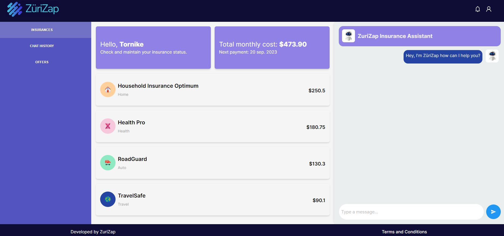

# hackzurich2023-zurichinsurance



Try-out our Insurance Assistant ZuriZap at https://hackzurich23-frontend-emcg5a6iia-oa.a.run.app/

## Components
Our solution consists of three components:
- Qdrant Vector Database
- FastAPI Backend
- React Frontend

### Qdrant Vector Database
Qdrant is a vector database that allows to store and search for vectors. The Zurich Insurance General Term and Conditions as well as the policies of users are uploaded as embeddings to our **Private** vector database. The embeddings are computed using the OpenAI API.

### FastAPI Backend
The FastAPI Backend is the interface between the Qdrant Vector Database and the React Frontend. It provides the following endpoints:
- List all active insurance policies of a customer
- List all (open) claims of a customer
- Open a new claim for a customer
- Close a claim for a customer

### React Frontend
The React Frontend is the interface between the user and the FastAPI Backend. It provides the following features:
- Overview of all active insurance policies of a customer
- Insurance assistant helping a customer with its insurance policies through natural language:
  - Retrieving information about the insurance policies
  - Explaining the insurance policies in understandable language
  - Receiving status updates about the insurance claims
  - Open/close insurance claims through the assistant

## Build Docker Images (Optional)

Pre-built images are available on Docker Hub or can be built locally using the instructions below.
- https://hub.docker.com/r/qdrant/qdrant
- https://hub.docker.com/repository/docker/mielverkerken/hackzurich23-frontend/general
- https://hub.docker.com/repository/docker/mielverkerken/hackzurich23-backend/general

### FastAPI Backend
```bash
cd backend
docker build -t mielverkerken/hackzurich23-backend:0.2.9 .
docker push mielverkerken/hackzurich23-backend:0.2.9
```

### FastAPI Backend
```bash
cd frontend/ZuriZap
docker build -t mielverkerken/hackzurich23-frontend:0.0.2 .
docker push mielverkerken/hackzurich23-frontend:0.0.2
```

## Deploy Docker Images to GCP

### FastAPI Backend
```bash
gcloud run deploy hackzurich23-backend --image=mielverkerken/hackzurich23-backend:0.2.9 --platform managed  --update-env-vars OPENAI_API_KEY=<OPENAI_API_KEY>
```

### React Frontend
```bash
 gcloud run deploy hackzurich23-frontend --image=mielverkerken/hackzurich23-frontend:0.0.2 --platform managed
```